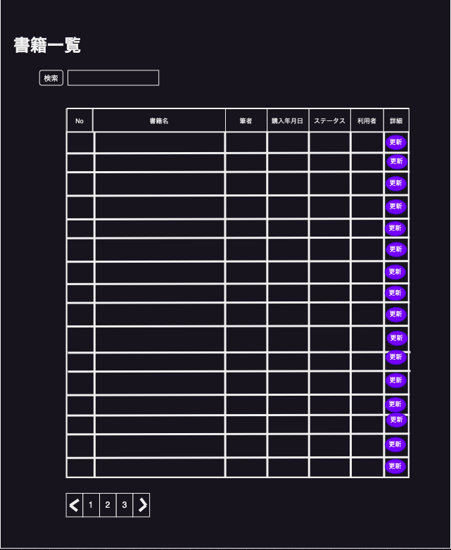

# A-001_書籍一覧画面_簡易設計書

## 書籍一覧イメージ

## 項目一覧

| No | 項目名 | 種別 | 備考 |
| :---: | --- | --- | --- |
| 1 | タイトル | テキスト | - |
| 2 | 検索ボタン | ボタン | 書籍をフィルタリングする際に使用 ※ |
| 3 | 検索入力欄 | テキストボックス | 書籍をフィルタリングする際に使用 ※ |
| 4 | No | テキスト | 書籍idを表示 |
| 5 | 書籍名 | テキスト | - |
| 6 | 筆者 | テキスト | - |
| 7 | 購入年月日 | テキスト | - |
| 8 | ステータス | テキスト | 延滞の場合はステータスを赤色表示 ※ |
| 9 | 利用者 | テキスト | - |
| 10 | 詳細 | テキスト | 書籍情報更新画面に遷移するためのボタンを設置 |
| 11 | 更新ボタン | ボタン| - |
| 12 | ページジャー | ボタン| 書籍を20冊毎にページを分ける ※ |

- ※ がついている項目は時間があれば実装する。
- book_infomationsテーブルのdalete_flagが1である書籍は表示しない。

## イベント

| No | 項目No | イベント内容 |
| :---: | :---: | --- |
| 1 | 2 | No3検索入力欄に入力した書籍名のみを一覧に表示する。 |
| 2 | 11 | A-002_書籍情報更新画面に遷移する。 |
| 3 | 12 | ページを切り替える。 |
