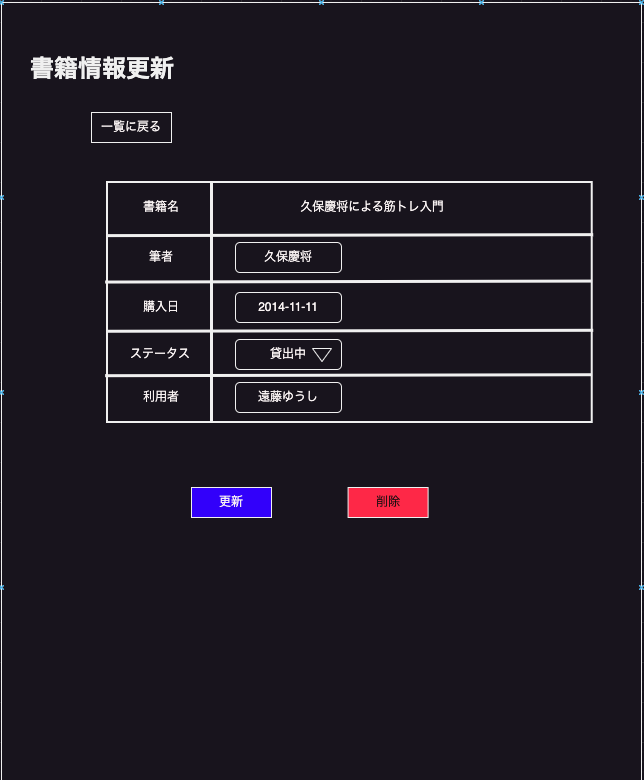

# A-002_書籍情報更新画面_簡易設計書

## 書籍一覧イメージ

##  Route

http://localhost:8081//change

## パラメータ

| No | 項目名 | 種別 | URL例 |
| :---: | --- | --- | --- |
| 1 | 書籍id | クエリーパラメータ | http://localhost:8081//change?book_id=1|

## 項目一覧

| No | 項目名 | 種別 | 備考 |
| :---: | --- | --- | --- |
| 1 | タイトル | テキスト | - |
| 2 | 戻るボタン | ボタン | - |
| 3 | 書籍名 | テキスト | 更新不可 |
| 4 | 筆者 | テキストボックス | 更新可 |
| 5 | 購入年月日 | テキストボックス | 更新可 |
| 6 | ステータス | プルダウン | 更新可 [貸出可、貸出中、延滞、行方不明、紛失]を表示 |
| 7 | 利用者 | テキストボックス | 更新可 |
| 8 | 更新ボタン | ボタン| 書籍の情報を更新する際に使用 |
| 9 | 削除ボタン | ボタン| 書籍の登録を削除する際に使用 |

## イベント

| No | 項目No | トリガー | イベント内容 |
| :---: | :---: | :---: | --- |
| 1 | 2 | 押下 | A-001_書籍一覧画面に遷移する. |
| 2 | 6 | 押下 | 書籍のステータスを表示する |
| 3 | 8 | 押下 | 書籍情報を更新する。 |
| 4 | 9 | 押下 | 書籍情報を削除する。 |
