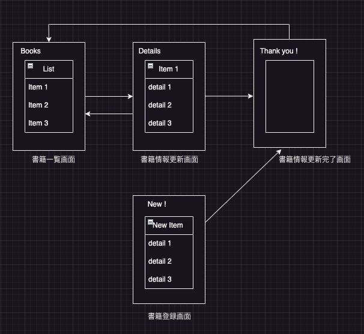

# 要件定義書

## 概要

- 書籍を管理するシステムを開発する.
- 作成する画面は三つ。

## 実装する画面

| No | 画面名 | 概要 | URL |
| :---: | :---: | --- | --- |
| A-001 | 書籍一覧画面 | 登録書籍の一覧を表示する画面 時間があればフィルタリング機能も実装する | http://localhost:8081//list |
| A-002 | 書籍情報更新画面 | 書籍の詳細を確認または書籍情報の変更を行う画面 | http://localhost:8081//change |
| A-003 | 書籍情報登録/更新完了画面| 書籍情報の変更が完了したことをお知らせする画面 | http://localhost:8081//complted |
| A-004 | 書籍登録画面 | 書籍を登録する画面　|http://localhost:8081//register |

## フロー

## 要件

- 登録済みの書籍を一覧として表示できること。
- A-001_書籍一覧画面から書籍を選択し、A-002_書籍情報更新画面に遷移できること。
- 書籍の情報を更新できること。
- 書籍の登録を削除できること。
- A-002_書籍情報更新画面からA-003_書籍情報登録/更新完了画面に遷移できること。
- A-001_書籍一覧画面からA-004_書籍登録画面に遷移できること。
- A-004_書籍登録画面からA-003_書籍情報登録/更新完了画面に遷移できること。
- 書籍情報を更新できること
- 書籍一覧画面で書籍名を検索し、フィルタリングできること。 ※
- 書籍の情報を20冊毎に分けてページを表示すること。 ※

※は時間があればチャレンジする。
