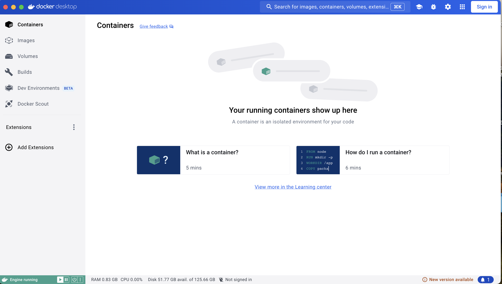
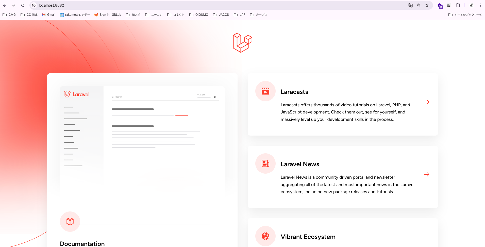
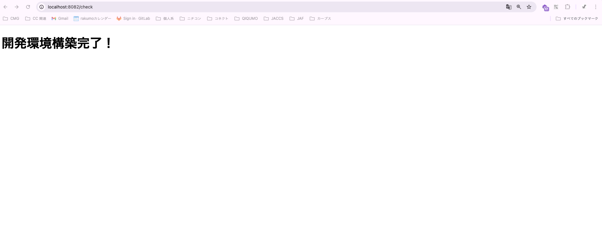

# 課題①開発環境構築

## 説明

- 自宅のPCで研修アプリを開発するための環境構築を行います。
- WindowsでもMacでも利用可能です。
- 基本的にコピペしする作業ですが、エラー出た際は研修担当者に相談ください。内定者研修だと重すぎる内容なので。
  
## 開発環境構築手順

#### 1.githubのリモートリポジトリをクローン

- 一年目とハンズオン形式で実施
- ブランチはdevelop
- gitbash等のターミナルは準備されている前提です。

#### 2.Dockerデスクトップをインストール

- 参照資料
  - https://qiita.com/zembutsu/items/a98f6f25ef47c04893b3
  - 使用PCがmacの場合はdockerdesktop for macで検索してください。
  
- 下記の画像のようにアプリを開けていればOK！！
 

#### 2.ベースイメージをビルド

- 実行する際はカレントディレクトリを「WelcomeStudy2025」にしておくこと。
- ブランチは自分が作成したブランチでお願いします。
- 下記のスクリプト2つを順序通りに実行する。
- PCによってはビルドするのに時間がかかります

```
./script/docker_build_base.sh
```

```
./script/docker_build_develop.sh
```

実行の様子

#### 3.Dockerコンテナを起動

```
docker-compose up -d
```

#### 4.webserverに接続（webserverコンテナに入る）

```
docker exec -it webserver bash
```

#### 5.Laravelをインストール

```
composer install
```

#### 6.環境設定ファイルの切り替え

```
cp .env.local .env
```

#### 7.DB初期化

```
php artisan migrate
```

#### 8.アプリケーションキー(APP_KEY)を設定する

```
php artisan key:generate
```

## 課題のクリア条件

①ブラウザで「http://localhost:8082/」を検索し、下記の画像が表示されること

 

②ブラウザで「http://localhost:8082/check」を検索し、下記の画像が表示されること

 