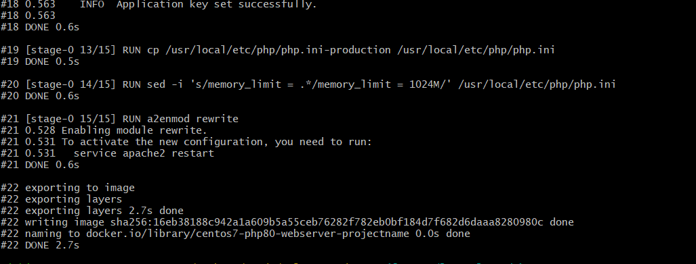

# 課題①開発環境構築

## 説明

- 自宅のPCで研修アプリを開発するための環境構築を行います。
- WindowsでもMacでも利用可能です。
- 基本的にはコピペで完了する課題ですが、エラー出た際は研修担当者に相談ください。

※ エラー出た場合の開発環境の修正作業は今回の課題対象外です

## 開発環境構築手順

#### 1.githubのリモートリポジトリをクローン

- 前提条件
  - 一年目とハンズオン形式で実施すること。
  - 作業ブランチはdevelopから切ること。
  - gitbash等のターミナルは準備できていること。


- 画像の説明
  - デスクトップに移動。研修用のフォルダstudyを作成（フォルダの置き場所と名前はなんでもOK）
  - studyの階層に移動してgitをクローンする。
  - ブランチをdevelopからきる。


#### 2.Dockerデスクトップをインストール

- 参照資料
  - https://qiita.com/zembutsu/items/a98f6f25ef47c04893b3
  - 使用PCがmacの場合はdockerdesktop for macで検索してください。
  
- 下記の画像のようにアプリを開けていればOK！！
 

#### 2.ベースイメージをビルド

- 実行する際はカレントディレクトリを「WelcomeStudy2025」にしておくこと。
- ブランチは自分が作成したブランチでお願いします。
- 下記のスクリプト2つを順序通りに実行する。
- ビルドするのに時間がかかります。

```
./script/docker_build_base.sh
```

一つ目のスクリプトを実行します。
 

同じように出ていればOK
  

```
./script/docker_build_develop.sh
```
二つ目のスクリプトも実行します。

  

  同じように出ていればOK
  


#### 3.Dockerコンテナの起動

```
docker-compose up -d
```


  
Dockerデスクトップを確認  
コンテナのロゴが緑色で表示されていれば一旦OK


#### 6.環境設定ファイルの切り替え

```
// カレントディレクトリをwebappにする
cd container_root/webapp

// .env.localファイルを.envファイルにコピー
cp .env.local .env
```


#### 4.webserverに接続（webserverコンテナに入る）

```
docker exec -it webserver bash
```

root@xxxxxxxxxxxx:/var/www/webapp#
と表示されるはず。


#### 5.Laravelをインストール

webserverコンテナに入っている状態（root@xxxxxxxxxxxx:/var/www/webapp#）でLraravelをinstall
```
composer install
```


#### 7.DB初期化

こちらもwebserverコンテナに入っている状態で実行
```
php artisan migrate
```

#### 8.アプリケーションキー(APP_KEY)を設定する

```
php artisan key:generate
```


## 課題のクリア条件

①ブラウザで[http://localhost:8082](http://localhost:8082)を検索し、下記の画像が表示されること


②ブラウザで[http://localhost:8082/check](http://localhost:8082/check)を検索し、下記の画像が表示されること


課題終了です！