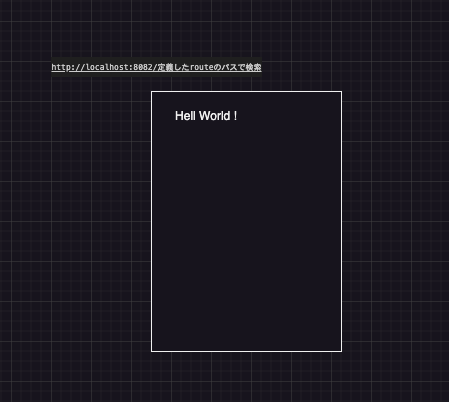

# 課題②Hello Worldの表示

## 前提条件

- 課題①が完了していること。

## 説明

- routeとControllerとviewを用いてブラウザの画面に「Hello Wold」を表示する。
- ヒント
  - Laravelのアーキテクチャ
  - MVCって何？
  - Laravelのrouteって何？
  - LaravelのControllerって何？
  - LaravelのView(blade)って何？

## 課題のクリア条件

- ブラウザに「Hello Wold」が表示されること
  - 「http://localhost:8082/定義したエンドポイント」をブラウザで検索して表示確認できます。
  
- 「Hello Wold」の文字列はControllerの変数で定義し、viewに変数を渡していること

#### イメージ

