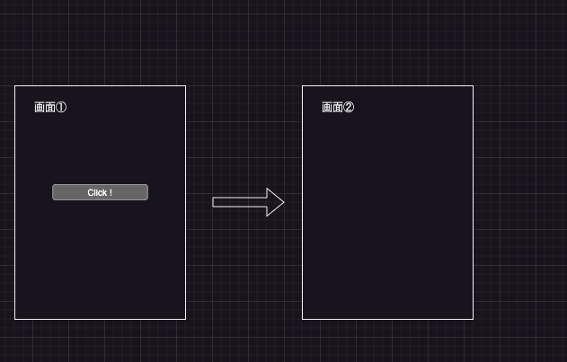

# 課題③画面遷移

## 前提条件

- 課題②が完了していること。

## 説明

- Webページ①と②の画面を用意する。①にはボタンを用意し、そのボタンを押下することで画面②に遷移するようにする

- ヒント
  - 初めに画面を２つ用意しよう（routeとControllerとbladeを書く）
  - 画面にボタンを設置する方法を調べてみる

## 課題のクリア条件

- 画面を用意してボタンによって画面を切り替えられること

#### イメージ

## ＋アルファ（余裕があれば）

- 画面②から①に戻るボタンを実装してみよう
